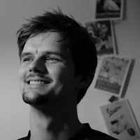

My name is Ulrich Noebauer and I am a postdoctoral researcher at the
[Max-Planck-Institut für Astrophysik in Garching][MPA], Germany, working in the
[research group][stellhyd] of [Wolfgang Hillebrandt][wfh] as part of the
Transregional Collaborative Research Centre [TRR 33][tr33], "The Dark Universe".

### Current Research: Supernovae

From the iron in our blood to the silicon in our computer chips, heavy elements
are forged when stars die. My research at MPA is dedicated to shedding more
light onto a particular class of these stellar deaths, so-called Type Ia
Supernovae. For this purpose, I develop, implement and apply advanced numerical
techniques to simulate hydrodynamical phenomena and radiative transfer
processes in these systems on the computer. In this capacity, I am also an
active member of the core development team of the open-source, community-driven
Monte Carlo Radiative Transfer code [Tardis][tardis]. Recently, in the course
of the master project of Stefan Lietzau that I supervised together with
[Wolfgang Kerzendorf][kerzen], I have become very interested in machine
learning techniques and in their application to the rapid generation of
theoretical observations for Type Ia Supernovae. 

In pursuing my research, I closely work with a number of colleagues, most
notably with Talytha Barbosa, [Sergei Blinnikov][sergei], [Wolfgang
Kerzendorf][kerzen], [Markus Kromer][kromer], [Friedrich Roepke][fritz],
[Stuart Sim][sim], Stefan Taubenberger and Christian Vogl. I also frequently
collaborate with [Alexandra Kozyreva][kozyreva] and [Raphael Hirschi][hirschi]
to study the pair instability supernovae mechanism which is proposed for the
powerful stellar explosions that end the life of very massive stars.

### Past Research: Radiation Hydrodynamics and Cataclysmic Variables

In the past, I have developed a novel approach to radiation hydrodynamics
problems during my PhD. This scheme has been implemented into a numerical tool,
called [MCRH][mcrh1], and applied [supernova ejecta][mcrh1] and [hot-star
winds][mcrh2].  Previously, I have used the Monte Carlo radiative transfer
techniques (in particular the code PYTHON) to investigate the geometry and
ionization structure of the mass outflows from Cataclysmic Variables together
with [Knox Long][knox] at the [Space Telescope Science Institute][stsci].

If you are interested in these topics, check out my [research interests][myres]
or my [publications][mypub].

## Address

Dr. Ulrich Noebauer

Max-Planck-Institut für Astrophysik  
Karl-Schwarzschild-Str. 1  
D-85748 Garching  
Germany  

Tel: 089 30000 2297  
Email: unoebauer [at] mpa-garching.mpg.de

[b15]: http://darkuniverse.uni-hd.de/view/Main/ProjectB15
[tr33]: http://darkuniverse.uni-hd.de/view/Main/WebHome 
[MPA]: http://www.mpa-garching.mpg.de/
[wfh]: http://www.mpa-garching.mpg.de/~wfh
[kromer]: http://www.markus-kromer.de
[sim]: http://pure.qub.ac.uk/portal/en/persons/stuart-sim(5340d718-acee-47fa-baac-cc98a1b607f8).html
[fritz]: http://www.friedrich-roepke.de/
[stellhyd]: http://mpa.iwww.mpg.de/27937/Stellar_Astrophysics#ODMSE
[stsci]: http://www.stsci.edu/portal/
[tardis]: https://github.com/tardis-sn/tardis
[sergei]: http://dau.itep.ru/sn/member/sb
[knox]: http://www.stsci.edu/~long/
[myres]: {{ site.url }}
[mypub]: {{ site.url }}/publications
[mcrh1]: http://adsabs.harvard.edu/abs/2012MNRAS.425.1430N
[mcrh2]: http://adsabs.harvard.edu/abs/2015MNRAS.453.3120N
[kerzen]: http://www.eso.org/~wkerzend/#home
[hirschi]: https://www.keele.ac.uk/physics/people/rhirschi/
[kozyreva]: http://www.astro.keele.ac.uk/~kozyreva/
